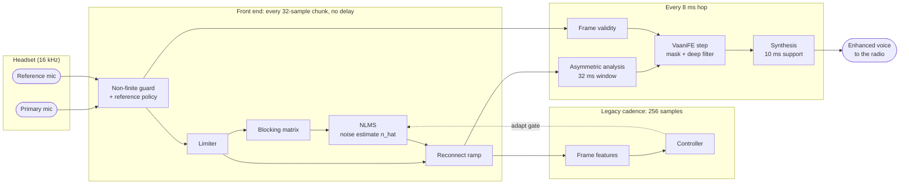

<div align="center">

# VAANI — Dual-Mic AI/ML enabled Speech Enhancement in Real Time

**SIH 2026 · Problem SIH26052 · DRDO**<br/>
Real-time speech enhancement for a two-microphone headset under stationary, changing and impulsive
(gunfire, blast) noise. Adaptive NLMS filtering feeds a small streaming neural network, with
**10 ms of algorithmic delay**.

[](https://sih.gov.in/)
[](docs/requirements-traceability.md)
[](https://drdo.gov.in/drdo/)

[](https://www.python.org/)
[](native/vaani_ld/README.md)
[](https://pytorch.org/)
[](https://developer.nvidia.com/cuda-toolkit)
[](https://onnxruntime.ai/)
[](https://numba.pydata.org/)
[](https://github.com/LCAV/pyroomacoustics)
[](https://docs.astral.sh/uv/)
[](https://docs.pytest.org/)

[](https://www.nvidia.com/en-us/autonomous-machines/embedded-systems/jetson-orin/)
[](https://www.raspberrypi.com/products/raspberry-pi-5/)
[](https://www.alsa-project.org/)

</div>

---

## The flagship: VAANI-LD with NLMS

VAANI-LD is the r8 low-delay pipeline. It combines three parts:

- a classical adaptive front end: limiter, blocking matrix and a **decoupled-cadence NLMS** that
  estimates the noise from the reference mic;
- a streaming **VaaniFE** network that reads the primary, the reference and the NLMS noise
  estimate `n_hat`;
- an asymmetric STFT: a 32 ms analysis window, an 8 ms hop and a 10 ms synthesis support. The
  10 ms support is the whole algorithmic delay.

This is the system the SIH submission proposes. In config terms it is the **Arm B contract with
`inputs: pr_nhat`** (`configs/retraining/r8_ld_ablations/ld_b_nhat_s{0,1}.yaml`).

> [!IMPORTANT]
> **Status.** The flagship *as configured* (with `n_hat`) has **not been trained yet**. Every
> component is built and tested: the NLMS, the front end, the network, export, the Python streaming
> engine and the evaluation route. The same contract **without** `n_hat` (`inputs: pr`) **is**
> trained: the Arm B Mini, 200,000 steps. The Arm B tier graphs are timed on a Raspberry Pi 5.
> The native C++ runtime does not have an NLMS stage yet. Every result below says which variant
> it comes from. See [Status](#status-what-is-built-trained-and-measured).

| | |
|---|---|
| **Algorithmic delay** | **10 ms**: 32 ms analysis window, 8 ms hop, 10 ms synthesis support (contract `vaanife_ld_asym512_h128_s160_v1`) |
| **Front end** | non-finite guard → reference policy → delay-free limiter → blocking matrix → NLMS `n_hat` (gated by the legacy controller) → 192 ms reconnect ramp |
| **Network** | VaaniFE: sub-band encoder, K × (time GRU + frequency self-attention), decoder, unbounded complex mask + 3-tap deep filter over 0–4.5 kHz |
| **Mini with `n_hat`** | 44,782 parameter entries, 89.220 MMAC/s: inside the Pi budget of 60,000 entries and 90.706 MMAC/s |
| **Tiers** | Mini → Mid → Large → Large+ on one contract and one front end (≈30k to ≈530k parameters) |
| **Pi 5 compute** | the four Arm B tier graphs (`pr`): **0.50 / 1.05 / 2.32 / 3.04 ms** mean per 8 ms hop on one core, native C++ runtime |
| **Edge target** | NVIDIA Jetson AGX Orin 64GB (TensorRT). Nothing has been measured on an Orin |
| **Design targets** | SNR_out > 15 dB · STOI > 0.85 · PESQ > 2.5 · < 15 ms latency |

SNR_out is the **absolute** output SNR, not the SNR improvement:

```math
\mathrm{SNR}_{\text{out}} = 10\log_{10}\frac{\lVert s\rVert^{2}}{\lVert \hat{s}-s\rVert^{2}}
```

Here $`s`$ is the clean primary-mic speech and $`\hat{s}`$ the enhanced output, so any distortion
counts as error.

**Scope.** VAANI cleans the **transmitted** voice before it reaches the radio. It does not cancel
noise at the wearer's ear: no secondary-path model, no FxLMS and no error mic.

## Contents

- [How VAANI-LD works](#how-vaani-ld-works): [Per-hop pipeline](#per-hop-pipeline) ·
  [Asymmetric STFT](#the-asymmetric-stft-why-10-ms) · [Decoupled-cadence NLMS](#decoupled-cadence-nlms) ·
  [VaaniFE](#the-vaanife-network) · [Reference faults](#reference-faults-and-validity) · [Loss](#training-objective)
- [Status: what is built, trained and measured](#status-what-is-built-trained-and-measured)
- [Model family and edge compute](#model-family-and-edge-compute)
- [Latency budget](#latency-budget)
- [Results](#results): [r8 Minis](#r8-minis-val) · [Reference robustness](#reference-robustness-r7-against-r8) ·
  [r7 baseline](#the-r7-baseline-32-ms)
- [Known limitations](#known-limitations)
- [Setup](#setup) · [Data](#data-and-eval-sets) · [Train](#train-and-evaluate) ·
  [Native runtime and the Pi](#native-runtime-and-the-pi) · [Live capture](#live-capture)
- [History: r1 to r8](#history-r1-to-r8) · [Layout](#layout) · [Licence](#licence)

---

## How VAANI-LD works

### Per-hop pipeline



The order within one hop matches `vaani/dsp/low_delay_frontend.py` and `vaani/low_delay_live.py`:

1. **Guard.** Non-finite reference samples count as unavailable. A non-finite primary sample is
   zeroed and flagged; the caller resets or bypasses on the flag.
2. **Reference policy.** Unavailable reference samples are zeroed before the limiter.
3. **Limiter.** The r8 limiter on 32-sample sub-blocks. It is delay-free and gives the same samples
   whatever the hop size.
4. **NLMS.** The blocking matrix and the NLMS run on the limited reference and produce `n_hat`. The
   legacy features and controller gate adaptation on their own 256-sample cadence.
5. **Ramp.** After a reference dropout, the reference and `n_hat` fade back in over 3,072 samples
   (192 ms).
6. **Network.** The asymmetric analysis feeds one VaaniFE step with the frame's validity. The
   network's complex mask and deep filter are applied, then the synthesis window. The output is
   released 10 ms after the input sample that completes it.

The Python streaming engine (`LowDelayStreamEngine`) and the offline evaluation route
(`vaani/enhance_low_delay.py`) run this same code, so training, scoring and streaming see identical
samples (`tests/test_low_delay_stream.py`, `tests/test_low_delay_eval.py`).

### The asymmetric STFT: why 10 ms

A symmetric 512/256 STFT (r7 and the r8 C0 control) costs 32 ms of algorithmic delay, because
every output sample waits for a full window. VAANI-LD splits the two windows:

- the **analysis** window stays long: K = 512 samples = 32 ms, for frequency resolution;
- the **synthesis** window is short: support L = 160 samples = 10 ms;
- the **hop** is H = 128 samples = 8 ms. The crossfade X = L − H = 2 ms is held for the next hop.

From `vaani/audio_contract.py`, with $`H < L \le 2H`$:

```math
a[n] = \begin{cases} \sin\!\big(\tfrac{\pi n}{2(K-H)}\big) & n < K-H \\ \cos\!\big(\tfrac{\pi (n-K+H)}{2H}\big) & n \ge K-H \end{cases}
\qquad
s[n] = \frac{p[n]}{a[n]}\ \text{where}\ a[n] > 0
```

Here $`p`$ is zero before $`K-L`$, has raised-cosine crossfades of $`X`$ samples, and overlap-adds
to 1. A trained mask is specific to its synthesis support, so every network is stamped with its
**audio contract**. The ONNX metadata, the `model_config.json` sidecar and the native runtime all
refuse a graph run on any other contract.

| Contract | Role | Hop | Algorithmic delay |
|---|---|---:|---:|
| `vaanife_r8_control_legacy512_h256_v1` | C0: r7's framing, the like-for-like control | 16 ms | 32 ms |
| `vaanife_ld_asym512_h96_s{160,144,128}_v1` | Arm A (L = 10, 9 or 8 ms) | 6 ms | 8–10 ms |
| **`vaanife_ld_asym512_h128_s160_v1`** | **Arm B: the flagship contract** | **8 ms** | **10 ms** |

Only Arm B has room for `n_hat`: the Arm A Mini with `n_hat` has 63,798 entries, over the
60,000-entry budget (R8 runbook, decision D5).

### Decoupled-cadence NLMS

The legacy pipeline runs the NLMS, the features and the controller together on 256-sample blocks,
but the low-delay contracts use 96- or 128-sample hops. `vaani/dsp/decoupled_nlms.py` separates the
two rates:

- **NLMS** runs sample by sample on 32-sample chunks, using the unchanged kernels from
  `vaani.dsp.nlms` and `vaani.dsp.blocking`. 32 divides every hop (96, 128, 256), so `n_hat` does
  not depend on the hop size. The only look-ahead is inside the current chunk, so **no delay is
  added**.
- **Gate.** The unchanged legacy `FrameFeatures` and `Controller` run on their own 256-sample
  cadence, using completed past frames only. The gate lags by at most one legacy frame and only
  freezes adaptation (for example on speech or bursts); it never touches the audio path.
- **Checks.** It is hop-invariant and causal. It is bit-exact with `pipeline.run` with the
  controller off, and with the legacy controller on its cadence (`tests/test_decoupled_nlms.py`).

`n_hat` enters the network as an extra pair of spectral planes, multiplied by reference validity
like every other reference-derived plane. The network learns how far to trust the adaptive
estimate.

### The VaaniFE network

`vaani/models/vaani_fe.py` holds a dual-mic RNNFormer-style network adapted from FastEnhancer. It
streams one frame at a time:

| Stage | What it does |
|---|---|
| Inputs (`pr_nhat`, 7 planes) | power-law compressed (\|X\|^0.3) real/imaginary planes of primary, reference and `n_hat`, plus validity. Reference-derived planes are multiplied by validity inside the model |
| Encoder | frequency convolutions with time kernel 1 over **p32** sub-band windows, then L extra convolutions. A learned validity bias replaces the validity plane |
| Blocks (× K) | a one-step **time GRU** per frequency token, then **multi-head self-attention across frequency** within the frame. The GRU hidden states (K × F × C2 floats) are the only recurrent state |
| Decoder | mirrors the encoder back to full resolution |
| Output | an **unbounded complex mask** on the compressed primary, which corrects phase as well as magnitude, plus a **3-tap deep filter** over the lowest 144 bins (0–4.5 kHz, lags 0, 2, 4) for the speech band |

The exported step graph is loop-free: GRUs become Gemm cells, shapes are static, and there is no
ScatterND and no Shape/Range. Every tier passes the G2 graph gate (`scripts/graph_gate.py`): fewer
than 250 folded nodes, layout ops under 30 %, and ORT-vs-torch and streaming-vs-offline parity
within 1e-5. That graph shape is what TensorRT and CUDA-graph capture need on the Orin. Whether a
given TensorRT version builds these graphs is **not yet tested**.

### Reference faults and validity

A headset's reference mic can disconnect, clip, lag or pick up the talker. Training corrupts the
reference on purpose:

- `data.ref_corrupt` with p = 0.15, plus 0.15 fully absent;
- fault types: dropout, burst, delay, gain, polarity, clip, unrelated noise, low-pass and speech
  leak;
- each fault carries a per-frame validity label.

The network sees validity, so **one model is its own mono fallback**: with validity 0 it ignores
the reference, and no second model ships. The front end freezes the NLMS while the reference is
absent and ramps back in over 192 ms when it returns.

### Training objective

All r8 runs use the FE loss (`loss: fe`, `vaani/losses.py::FELoss`). VAANI-LD computes it **after
re-synthesis** (`loss_domain: resynthesis`, `vaani/enhance_low_delay.py::ResynthesisFELoss`). The
predicted spectrum becomes a waveform $`\hat{y}`$ through the contract's real low-delay synthesis
window, and the clean target $`y`$ is trimmed to the same samples. Both are then re-analysed with the
512/256 STFT, $`\hat{S} = \mathrm{STFT}(\hat{y})`$ and $`S = \mathrm{STFT}(y)`$, so the loss scores
the samples the listener hears, not the network's internal spectrum.

Spectra are power-law **compressed**, keeping the phase:

```math
\tilde{S} = |S|^{p}\, e^{j\angle S}
```

```math
\mathcal{L} \;=\;
w_m\,\overline{g_\kappa\big(|S|^{p}-|\hat S|^{p}\big)^{2}}
\;+\; w_c\,\overline{\big|\hat{\tilde S}-\tilde S\big|^{2}}
\;+\; w_{\text{wave}}\,\overline{|\hat y - y|}
\;+\; w_{\text{pesq}}\,D_{\text{PESQ}}(\hat y, y)
\;-\; w_{\text{snr}}\,\overline{\min\!\big(\mathrm{SNR}_{\text{out}},\,30\ \mathrm{dB}\big)}
```

```math
g_\kappa(x) = \begin{cases} \kappa\,x & x > 0\ \text{(output quieter than the target)} \\ x & x \le 0 \end{cases}
```

The overline is the mean over items and over bins and frames (or samples); $`\mathrm{SNR}_{\text{out}}`$
is the absolute output SNR defined at the top.

- **Compressed terms.** Compressing by $`|S|^p`$ before the spectral MSE is a perceptual weighting:
  power-law compression approximates the compressive loudness response of hearing. The complex term
  $`|\hat{\tilde S}-\tilde S|^2`$ is the squared error of the real and imaginary parts, so it also
  carries phase. p = 0.3 is the upstream default; r7 used 0.5.
- **Over-suppression (κ = 3).** $`g_\kappa`$ is VoiceFilter-Lite's asymmetric loss. It scales the
  error by κ **before** squaring, so where the output is quieter than the target (speech removed) an
  error costs κ² = 9 times a same-size error where it is louder (noise left). κ = 1 is plain
  magnitude MSE.
- **PESQ term.** $`D_{\text{PESQ}}`$ is `torch_pesq`'s differentiable distortion (0 = transparent),
  averaged over items whose target is audible. The r8 configs set `pesq_required: true`, so a run
  without `torch-pesq` refuses to start rather than training with the term silently at 0.
- **Weights.** $`w_m = 0.3`$, $`w_c = 0.2`$, $`w_{\text{wave}} = 0.2`$, $`w_{\text{pesq}} = 0.001`$,
  $`w_{\text{snr}} = 0.002`$, κ = 3, p = 0.3. $`w_{\text{snr}}`$ keeps r7's ratio of SNR weight to
  spectral weight (0.2 against $`w_c + w_m = 100`$) on these unit-sum weights; the code records it as
  an inferred starting point, not a tuned value.
- **C0 and the consistency term.** The r8 C0 control (`r8_fe_mini`, legacy 512/256 contract) uses
  `FELoss` on its own spectrum and adds an MP-SENet consistency term, weight 0.3: the compressed
  spectrum of $`\mathrm{STFT}(\mathrm{iSTFT}(\hat S))`$ against $`\hat{\tilde S}`$. After
  re-synthesis that term is zero up to rounding, so VAANI-LD sets its weight to 0. The `ld_s2_native`
  ablation instead puts the spectral and consistency terms on the low-delay spectra.

Training uses EMA weights (decay 0.999), and checkpoints are chosen by a composite val metric.

<details>
<summary><b>Training data (r8, mixer v2)</b></summary>

- **Speech:** LibriSpeech (100 h), EARS, Common Voice Hindi and Lombard GRID.
- **Noise:** ESC-50, DNS-5 Freesound, MAD (speech-filtered, `mad_v2`), the Zenodo 7004819 and
  Cadre gunshots, DEMAND two-mic pairs, AVQ drone, C3GD and FSD50K.
- **Synthetic impulses:** Friedlander blasts, bursts and click trains at 15–45 dB peaks
  ([below](#artillery-and-gunshot-transients-are-synthesised-deliberately)).
- **Mixer v2** (`MixConfig(version=2)`): SPL-calibrated battlefield scenes in which SNR is an output
  of the scene, not an input. It adds a boom-to-reference transfer with a low-ILD tail (40 % share),
  diffuse and near-field noise, wind, a microphone front end, Lombard tilt, clipping and the r8 RIR
  bank.
- **Held-out groups** for the pre-registered test set are excluded from training
  (`configs/data/r8_heldout_exclude.json`).

</details>

---

## Status: what is built, trained and measured

| Item | State | Evidence |
|---|---|---|
| Decoupled-cadence NLMS for low-delay hops | **built, tested** | `vaani/dsp/decoupled_nlms.py`, `tests/test_decoupled_nlms.py` |
| Low-delay front end, asymmetric STFT, audio contracts | **built, tested** | `vaani/dsp/low_delay_frontend.py`, `vaani/dsp/low_delay_stft.py`, `vaani/audio_contract.py`, `tests/test_low_delay_*.py` |
| Python streaming engine and eval route (accept `pr_nhat`) | **built, tested** | `vaani/low_delay_live.py`, `vaani/enhance_low_delay.py` |
| **Flagship: Arm B + `n_hat` (`ld_b_nhat_s{0,1}`)** | **configured, not trained** | it was queued as a P4 pilot and never reached. TBD: the full run and its comparison `arm_b_nhat_vs_arm_b` in `scripts/compare_r8_ld.py` |
| Arm B Mini, `inputs: pr` | **trained**, 200,000 steps (7.3 h) | `r8_runs_final/r8_ld_fe_mini_armb/` (local only), 40,302 deploy parameters |
| Arm A Mini, C0 Mini (`pr`) | **trained**, 200,000 steps each | `r8_runs_final/r8_ld_fe_mini/`, `r8_runs_final/r8_fe_mini/` (local only) |
| Final Mid and Large+ on Arm B (`pr`) | **configured, not trained** | the 2026-10-05 rental was stopped before its setup finished. TBD (Rachit): their step budget on the laptop queue (`configs/retraining/laptop_queue.txt`) |
| Native C++ runtime (`native/vaani_ld`) | **built**, golden-vector parity, arm64 cross-build under qemu | `results_r2/r8_ld/native/arm64_build.json`. **No NLMS stage yet** |
| Pi 5 timing of the Arm B tier graphs | **measured** 2026-10-05 (untrained `pr` graphs, native runtime) | board terminal output, not committed. TBD: commit `pi_results/tiers_armb/*.json` |
| Gate 0a (latency eligibility) | **pending_board** | `results_r2/r8_ld/gate0/README.md` |
| Acoustic mic-to-speaker delay | **not measured** | procedure in [`docs/acoustic_latency.md`](docs/acoustic_latency.md) |
| Jetson AGX Orin / TensorRT | **not measured**, no hardware access | — |

---

## Model family and edge compute

The tiers share the contract, the front end and the step-graph rules. Only width and depth change
(C1 = encoder width, C2 = block width, F = frequency tokens, K = blocks, L = extra encoder stages;
`configs/arch/vaani_fe_*.yaml`).

| Tier | C1/C2/F/K/L | Parameters (Arm B graph) | Pi 5 mean / p99 / max (ms per 8 ms hop) | Intended board | Trained |
|---|---|---:|---|---|---|
| **Mini** | 32/24/16/2/1 | 29,597 (native tiling) · 40,302 (p32, trained) · 44,782 entries with `n_hat` | **0.50** / 0.53 / 0.70 | Raspberry Pi 5 | `pr`: yes · `pr_nhat`: no |
| **Mid** | 48/40/32/3/2 | 107,934 · 123,910 (p32, final run) | **1.05** / 1.11 / 1.38 | Jetson AGX Orin | no (final run configured) |
| **Large** | 80/64/48/4/2 | 322,519 | **2.32** / 2.48 / 5.37 | Jetson AGX Orin | no |
| **Large+** | 96/72/48/4/3 | 500,367 · 533,463 (p32, final run) | **3.04** / 3.29 / 7.30 | Jetson AGX Orin | no (final run configured) |

- **Parameter counts** are ONNX initializer entries of the folded step graphs in
  `r8_runs_final/pi_bundle/tiers_armb/` and the Arm B Mini export (`export_report.json`). The
  `n_hat` Mini figure is the training-form entry count from the R8 runbook (D5).
- **How the Pi timing was taken.** `pi_bundle/tiers_armb/time_tiers.sh` ran `vld_step_bench` on a
  Raspberry Pi 5:
  - kernel 6.18.50+rpt-rpi-2712, not throttled (`get_throttled` 0x0);
  - 7,500 hops per graph, one thread pinned to core 3, flush-to-zero on;
  - random input on the 48 kHz path with the deploy resampler.

  Each figure is the whole hop: resampling, front end, analysis, ORT step and synthesis. The graphs
  are the **untrained** native-tiling tiers on `inputs: pr`, and timing does not depend on the
  weights.
- **Real-time scheduling.** Large+ under SCHED_FIFO with `mlockall` on core 3: mean 3.04, p99.9
  3.44, max **3.63 ms**. The Python ORT route at 1 and 4 threads had 0 late hops.
- **What is not timed:** the trained p32 graphs, the `n_hat` graph and the NLMS stage on the Pi.
  The NLMS costs about 0.21 s of CPU per 4 s of audio on the dev machine, in the training loader
  (*inferred*: about 5 % of one core; not a Pi measurement).
- **Orin.** Every tier fits the Pi's 8 ms hop on one core. The Orin brings a GPU and TensorRT on top
  of that. No Orin latency, power or larger-tier quality has been measured.

---

## Latency budget

| Term | Arm B | Source |
|---|---:|---|
| Algorithmic delay (synthesis support) | 10.0 ms | contract |
| Compute, worst case at Large+ under RT scheduling | 3.63 ms | Pi 5, above |
| 48 kHz resampler pair (R1, maximum group delay over 300–4,000 Hz) | 0.407 ms | `results_r2/r8_ld/gate0/resampler.json` |
| Converters (ADC + DAC) | 0.5 ms estimate; about 0.12 ms by datasheet for PCM512x + ICS-43434 | Gate 0a |

- **Algorithmic delay plus measured compute** is 10 + 3.63 = 13.6 ms, under the 15 ms target.
  That sum is not an acoustic measurement. Without real-time scheduling, Large+ peaked at 7.30 ms,
  which still fits the 8 ms hop but gives 17.3 ms in the same sum.
- **Gate 0a** uses a stricter 13.0 ms path budget. With the 0.5 ms converter estimate, L = 10 ms
  comes to 13.007 ms, just over that budget, so the gate stays `pending_board`. A measured converter
  path replaces the estimate (Gate 0b).
- **End-to-end** mic-to-speaker delay has not been measured. `docs/acoustic_latency.md` is the
  procedure: an independent two-mic recorder on one clock, and `scripts/acoustic_latency.py`.

---

## Results

Every SNR/STOI/PESQ score here comes from **synthetic mixtures** made by the project's own mixer.
No real noisy recording is scored on those metrics. **VAL only for r8:** the eval_r2 test split is
burned (`results_r2/r8/testset/PROTOCOL.md`). The pre-registered r8 test set (`data/eval_r8_test`,
hash `ed024af085a2`, 2,308 items) is scored once, after val selection. **TBD: not yet scored.**

### r8 Minis (val)

These are the in-training val monitor rows: EMA weights, 200 dynamic val items, the last snapshot
the scorer reached. They come from `scorer_state.json` in each local run directory. They are **not**
the registered comparison (`scripts/compare_r8_ld.py`), which is TBD.

| Run | Contract | Delay | Params (deploy) | Snapshot | SNR_out (dB) | STOI | PESQ-WB |
|---|---|---:|---:|---:|---:|---:|---:|
| C0 Mini (`r8_fe_mini`) | legacy 512/256 | 32 ms | 29,274 | 307 / 320 | 10.43 | 0.849 | 1.878 |
| Arm A Mini (`r8_ld_fe_mini`) | asym, H 96, L 128 | 8 ms | 55,222 | 135 / 320 | 9.81 | 0.835 | 1.734 |
| **Arm B Mini (`r8_ld_fe_mini_armb`)** | **asym, H 128, L 160** | **10 ms** | **40,302** | 164 / 320 | **10.05** | **0.839** | **1.785** |

Reading (*inferred*; the snapshots differ and there is one seed per arm): cutting the algorithmic
delay from 32 ms to 10 ms costs Arm B about 0.4 dB SNR_out and 0.01 STOI against C0 in this
monitor. No Mini reaches the design targets on val. That gap is what the larger tiers and the
`n_hat` input are meant to close, and neither has been shown to close it yet.

### Reference robustness: r7 against r8

A deterministic val run: 148 clips × 15 reference conditions, scored with
`scripts/eval_refvalid.py` (committed tables:
[`results_r2/r8/r7_refconditions_val.md`](results_r2/r8/r7_refconditions_val.md),
[`results_r2/r8/r8_fe_mini_refconditions_val.md`](results_r2/r8/r8_fe_mini_refconditions_val.md)).
The r8 row is the **C0 Mini**: mixer v2, reference corruption and validity, at r7's 32 ms
framing. A clip fails if speech loss > 0.15 or SNR_out < SNR_in − 1 dB.

| Condition | r7: SNR_out / STOI / fails of 148 | r8 C0 Mini: SNR_out / STOI / fails of 148 |
|---|---|---|
| reference present | **13.93 / 0.897 / 21** | 10.28 / 0.850 / 32 |
| reference absent | 7.39 / 0.783 / 54 | **8.71 / 0.816 / 44** |
| reference gain −12 dB | 5.09 / 0.822 / 16 | **9.63 / 0.843 / 33** |
| reference low-pass | 3.27 / 0.791 / 15 | **9.08 / 0.833 / 36** |
| talker leaks into the reference (−2 dB) | 0.13 / 0.489 / **148** | **7.99 / 0.811 / 52** |
| equal level on both mics (ILD 0 dB) | −0.02 / 0.535 / **148** | **6.54 / 0.797 / 65** |

r7 tells speech from noise almost entirely by the level difference between the mics. Its training
mixer made that cue nearly perfect (ILD-only AUC 0.989). When the reference hears the talker, r7
erases speech: speech loss is 0.953 under talker leak and 1.000 at ILD 0 dB. With mixer v2's
low-ILD tail and reference faults, the r8 Mini keeps working in every condition, at the price of
3.7 dB on the clean-reference case. The G1 data gate checks this cue before training: ILD-only AUC
0.727 and 0.697 under mixer v2, against a 0.75 limit
([`results_r2/r8/data_gates/`](results_r2/r8/data_gates/README.md)).

### The r7 baseline (32 ms)

r7 is the last model trained on the legacy pipeline. It is a GTCRN-derived backbone plus a residual
refiner, **52,747 parameters** and 82.460 MMAC/s, exported as `deploy/r7/cascade.onnx` (sha256
`e67a2c42…`; full hashes in [`deploy/CONTRACT.md`](deploy/CONTRACT.md)). It was trained from
scratch on our data with no external pretrained weights. It has the best clean-reference scores in
the repository, which is why it stays the control. Brackets are 95 % bootstrap intervals over
items; **bold** marks a target cleared on the interval.

| r7 cascade | n | SNR_out (dB) | STOI | PESQ-WB |
|---|---|---|---|---|
| eval_r2 nominal (input 0/5/10 dB, no clip or fault) | 617 | 14.864 [14.565, 15.183] | **0.917** [0.911, 0.922] | 2.462 [2.412, 2.511] |
| eval_r2 full test split | 2,280 | 12.778 [12.520, 13.023] | **0.870** [0.866, 0.874] | 2.138 [2.106, 2.169] |
| eval_gen, registered stationary grid | 102 | 14.295 [13.760, 14.857] | **0.932** [0.923, 0.940] | 2.490 [2.393, 2.588] |
| eval_gen, changing grid (added to the protocol later) | 99 | **18.370** [17.497, 19.316] | **0.970** [0.964, 0.976] | **3.153** [3.026, 3.269] |
| loud transients, input 0/5 dB | 240 | 10.866 [10.494, 11.206] | 0.848 [0.837, 0.858] | 1.797 [1.753, 1.843] |

<details>
<summary><b>r7 details: sources, per-clip pass rates, defence noise, lineage</b></summary>

**Sources.** [`results_r2/r7/breakdown.md`](results_r2/r7/breakdown.md) and
[`results_r2/generalisation/per_grid.md`](results_r2/generalisation/per_grid.md), both from
`uv run python scripts/r7_breakdown.py`. The scene-clustered intervals are wider: nominal SNR_out
[14.421, 15.339].

**Per clip, not per mean.** All three targets are met at once on 35.5 % of nominal clips, 24.1 %
of the full split and 3.8 % of transient clips. On eval_gen: 40.2 % (stationary) and 70.7 %
(changing).

**Gain over the unprocessed input** on the same nominal clips: +11.5 to +14.2 dB SNR_out by noise
class.

**Transients.** Against a matched no-burst control at the same input SNRs, the bursts themselves
cost 1.9 dB SNR_out, 0.034 STOI and 0.31 PESQ.

**Defence noise** ([`results_r2/defence/table.md`](results_r2/defence/table.md), 1,296 items:
6 categories × 6 input SNRs × 36):
- All three targets are cleared on the interval only at the easy end: blasts and helicopter at
  15 dB input, vehicle and siren at 10 and 15 dB.
- Recorded gunshots never clear them.
- No category passes at −10 to 0 dB input.
- r7 beats raw passthrough on SNR_out and STOI in all 36 cells.

**Lineage.**
- Backbone: 256 epochs from scratch (`r6_e256`), plus one 64-epoch warm restart (`r7_e256_wr64`).
- Refiner: 2,498 parameters, trained on the frozen backbone.
- Against the earlier tier46 cascade, paired per clip: SNR_out +0.110 dB [+0.061, +0.163] on
  eval_r2.

**Which render.** eval_r2 is the crest-audit relabelled render (`17a9414959bb` on Windows,
`aa96a28a9955` on Linux). External baselines and WER exist only on the earlier render
([`results_r2/matrix_prerelabel.md`](results_r2/matrix_prerelabel.md)). The two renders differ at
606 of 617 nominal items.

**Test-split use.** The eval_r2 test split informed r7's launch (r6 scored 14.83 dB on it), so it is
not an untouched held-out set for r7. r8 does not use it at all.

**r7's NLMS showed no measurable benefit.** On the earlier render, `nlms_only` scored 1.115 dB
against 1.974 dB for raw input. Zeroing `n_hat` inside r7 cost only 0.030 dB SNR_out on val
([`results_r2/r7/diag/README.md`](results_r2/r7/diag/README.md)). r7 relied on the ILD cue instead,
as shown above. This is why VAANI-LD tests `n_hat` as a controlled ablation (`ld_b_nhat` against
`ld_b`), now that mixer v2 removes the near-perfect ILD shortcut.

</details>

---

## Known limitations

- **The flagship is untrained.** No VAANI-LD-with-NLMS result exists yet, and the gain from `n_hat`
  on the low-delay path is unmeasured. On r7, the NLMS contribution was not measurable (above).
- **The native runtime has no NLMS stage.** On a board today, `pr_nhat` runs only through the Python
  engine (`LowDelayStreamEngine` with ONNX Runtime and numba). Porting the decoupled NLMS to
  `native/vaani_ld` is TBD.
- **No trained model meets all three targets on val.** The r8 Minis reach about 10 dB SNR_out,
  0.84 STOI and 1.8 PESQ. r7 reaches 14.9 dB, 0.917 and 2.46 on eval_r2 nominal.
- **Synthetic scores only.** The only real recordings scored are 192 MAD "communication" clips and
  one two-channel web WAV, with reference-free proxies (DNSMOS P.835, attenuation). DNSMOS alone
  can hide speech deletion ([`results_r2/real/table.md`](results_r2/real/table.md)).
- **Waiting on the unscored r8 test set:** drone, NOISEX-92, EARS loud speech and the windy-ridge
  scene are held out for it, so no score covers them yet.
- **Latency is not measured end to end.** See [Latency budget](#latency-budget).
- **Hardware.** There is no Orin access, no radio or PTT path, no power measurement, and no physical
  microphone prototype result. The enhanced output is the wearer's own voice, so the live loop plays
  nothing unless `--output-route` says where.
- **Licences.** Several training corpora are non-commercial or have unresolved terms; see
  [Licence](#licence).

[`docs/requirements-traceability.md`](docs/requirements-traceability.md) maps every clause of
SIH26052 to the file and measurement that answers it, including the clauses that are not met.

---

## Setup

Python 3.12 and [uv](https://docs.astral.sh/uv/). Torch comes from the cu128 index (Blackwell GPUs
need it); CPU-only machines still install and run.

```bash
uv sync --all-extras
uv run pytest -q     # CUDA tests skip without a GPU; VAANI_REQUIRE_CUDA=1 makes them fail instead
```

- `pesq` ships as a vendored Windows wheel in `wheels/`. On Linux and macOS, uv builds it from PyPI,
  which needs a C compiler.
- `tests/test_r7_artifact.py` pins the r7 graph: sha256 prefix `e67a2c42`, live vs offline < 1e-5,
  and the engine run with torch imports blocked.
- The board does **not** use this environment; see [Native runtime and the Pi](#native-runtime-and-the-pi).

---

## Data and eval sets

Everything under `data/` (manifests, RIR banks, eval renders) is git-ignored. The commands below
regenerate it, and each eval set's hash checks the render.

```bash
uv run python scripts/fetch_data.py                # r1-r7 corpora -> data/manifests/*.parquet
uv run python scripts/r8_datasets.py plan          # r8 registry (configs/data/r8_datasets.yaml): sizes and order
bash scripts/r8_box_setup.sh                       # rented GPU box: banks, mirror, datasets, pack, preflight
```

| Set | Hash | Items | Use |
|---|---|---:|---|
| eval_r2 val | — | val split | r8 model selection; the reference-condition tables use 148 of its clips |
| eval_r2 test (`data/eval_r2_relabel`) | `17a9414959bb` | 2,280 | r7 results; **burned**, not used by r8 |
| `data/eval_defence/test` | `d033568bdf98` | 1,296 | defence-noise categories ([README](results_r2/defence/README.md)) |
| `data/eval_r8_test/test` | `ed024af085a2` | 2,308 | pre-registered r8 test set, **not yet scored** ([PROTOCOL](results_r2/r8/testset/PROTOCOL.md)) |

### Artillery and gunshot transients are synthesised, deliberately

The public artillery recordings we could obtain come from YouTube. After loudness normalisation and
lossy coding, the transient is gone: MAD's `shelling` class measures **12.3 dB** event crest,
against **13 dB** for ordinary speech (`scripts/crest_audit.py`). Impulsive training material is
therefore generated from the **Friedlander blast wave** (`vaani/data/blast.py`):

```math
p(t) = P_0 \left(1 - \frac{t}{T}\right) e^{-t/T}, \qquad t \ge 0
```

$`P_0`$ is the peak overpressure. $`T`$ is the positive-phase duration: roughly 0.15–0.6 ms for
small arms at close range, several ms for artillery. The waveform is shaped in three steps:

1. it is synthesised at 192 kHz and decimated, so the rise does not alias;
2. a ground reflection arrives 1–9 ms later;
3. a distance-dependent low-pass is applied.

Physics v2 adds ISO 9613-1 air absorption, SPL-referenced levels (small arms 150–160 dB SPL at
1 m; artillery by Kinney-Graham) and bursts of 3–30 rounds at 650–700 rpm. The result measures
about **26.5 dB** event crest. Every impulse corpus must pass the crest gate before an adapter is
written for it.

### Splits

Manifests split by source recording (speaker or recording group) and drop byte-identical files, so
nothing appears in two splits. They store POSIX paths, so a manifest built on Windows loads on
Linux.

---

## Train and evaluate

```bash
# the flagship (Arm B + n_hat), one seed
uv run --with numba python -m vaani.train configs/retraining/r8_ld_ablations/ld_b_nhat_s0.yaml

# the trained Arm B Mini recipe (inputs pr)
uv run --with numba python -m vaani.train configs/retraining/r8_ld_fe_mini_armb.yaml

# the low-delay queue on a rented box: plan, start, status, decisions
bash scripts/run_r8.sh ld-plan
bash scripts/run_r8.sh ld-start pilots
bash scripts/run_r8.sh ld-status

# final Mid + Large+ on Arm B, one per GPU, until stopped (or TRAIN_END="YYYY-MM-DD HH:MM" for a time box)
bash scripts/final_launch.sh
bash scripts/final_launch.sh status
bash scripts/final_launch.sh export
bash scripts/final_launch.sh stop
```

- **Configs.** `scripts/gen_r8_configs.py --low-delay` generates every low-delay config from the C0
  config and the Gate 0a record. `--check` fails on any drift. Do not edit the generated files by
  hand ([`r8_ld_ablations/README.md`](configs/retraining/r8_ld_ablations/README.md)).
- **Runbook.** The decisions (D2 margins, D5 NLMS on the low-delay path, D8/D9) and every box
  command are in [`configs/retraining/R8_RUNBOOK.md`](configs/retraining/R8_RUNBOOK.md).
- **Resuming.** Checkpoints are written then renamed, so `export` is safe mid-run and `launch`
  resumes from `last.pt`.
- **Scoring.** `scripts/eval_refvalid.py --system ckpt:<run>/best.pt` gives the reference-condition
  tables. `scripts/compare_r8_ld.py` runs the registered seed-plus-clip comparison between arms.
- **Speed.** Training uses CUDA graphs, `torch.compile` and a fused GRU kernel; Large+ uses cuDNN
  because the fused kernel needs more than sm_120's 99 KB of shared memory. Mixing runs on CPU
  stream servers.

<details>
<summary><b>r1–r7 commands (legacy pipeline)</b></summary>

```bash
uv run python -m vaani.train configs/exp/vaani_full_r3_e32.yaml
uv run python -m vaani.eval --system vaani_full_r3_e32 --split test --eval-root data/eval_r2 \
    --workers 8 --asr --asr-device cuda --dnsmos
uv run python -m vaani.report "results_r2/r7/*_eval_r2.csv" --out results_r2/matrix.md
scripts/run_round.sh [1|2|3|3b|3c|3d|4]     # a whole ablation wave; resumes from last.pt
scripts/run_optimization.sh                 # INT8 and pruning, measured and rejected on the evidence
```

#### r1–r7 loss

`HybridLoss` (`vaani/losses.py`) works on power-law **compressed** spectra. Writing
$`S = |S|\,e^{j\angle S}`$ for a clean STFT and $`\hat{S}`$ for the estimate:

```math
\tilde{S} = |S|^{p}\, e^{j\angle S}
```

```math
\mathcal{L} \;=\;
w_c\Big[\mathrm{MSE}\big(\mathrm{Re}\hat{\tilde S},\mathrm{Re}\tilde S\big)
      + \mathrm{MSE}\big(\mathrm{Im}\hat{\tilde S},\mathrm{Im}\tilde S\big)\Big]
\;+\; w_m\,\mathrm{MSE}\big(|\hat S|^{p},\,|S|^{p}\big)
\;+\; \mathcal{L}_{\text{SI-SNR}}
\;-\; w_{\text{snr}}\,\min\!\big(\mathrm{SNR}_{\text{out}},\,30\ \mathrm{dB}\big)
```

- **Compressed-magnitude term.** Compressing by $`|S|^p`$ before the spectral MSE is a
  **perceptual weighting**: power-law compression approximates the compressive loudness response of
  human hearing, which is why it is the standard spectral loss in the DNS Challenge baselines and in
  GTCRN. $`p = 0.5`$ here, against the upstream default of 0.3, weights quiet spectral detail more
  heavily. It is not a PESQ or PMSQE surrogate.
- **Absolute-SNR term.** SI-SNR is scale-blind and the target is absolute, so the absolute
  $`\mathrm{SNR}_{\text{out}}`$ is added, clamped at 30 dB.
- **Weights.** The r6/r7 configs use $`w_c = 50`$, $`w_m = 50`$, $`p = 0.5`$,
  $`w_{\text{snr}} = 0.2`$.
- **Speech-preservation variant** (`SpeechPreservationLoss`, not used by r7). Adds an L1 term to
  the clean target on clean-bucket items.

Comparators were `gtcrn_pretrained` / `gtcrn_finetuned`, `nlms_only`, `raw`, RNNoise and
DeepFilterNet3 (in an isolated `.venv-dfn`). INT8 made the 52,747-parameter graph 19.7 % larger and
1.45× slower, so it was rejected.

</details>

---

## Native runtime and the Pi

`native/vaani_ld` is a C++17 runtime for the low-delay contracts. It runs the following stages per
hop, all checked against the Python golden vectors in `deploy/dsp_reference/vectors_ld/`:

1. the R0/R1/R2 resamplers;
2. the front end (non-finite guard, reference policy, limiter and ramp);
3. frame validity;
4. the asymmetric analysis (PocketFFT);
5. the ONNX Runtime 1.30 step;
6. the synthesis.

```bash
native/vaani_ld/deps/fetch_ort.sh                                   # x64 or aarch64, sha256-checked
cmake -S native/vaani_ld -B native/vaani_ld/build -DCMAKE_BUILD_TYPE=Release
cmake --build native/vaani_ld/build -j
native/vaani_ld/build/vaani_ld_run wav --model M.folded.onnx --contract vaanife_ld_asym512_h128_s160_v1 \
    --in mix.wav --out enhanced.wav
native/vaani_ld/build/vld_step_bench --model M.folded.onnx --contract vaanife_ld_asym512_h128_s160_v1 \
    --hops 7500 --input random --fz on --resampler deploy/resampler/r1_minphase_kaiser193_v1.json --cpu 3
```

- **`vaani_ld_run live`** runs ALSA duplex on linked hardware PCMs. It uses SCHED_FIFO,
  `mlockall`, a pinned CPU and denormal flushing. A deadline miss falls back to a
  **delay-matched bypass**, so the radio never goes silent. Each run writes a JSON report with
  `qualifies`.
- **`vaani_ld_run simulate`** models early, late and jittered step times and refuses settings that
  cannot meet the budget.
- **No allocations.** The DSP makes no allocations after warm-up. ONNX Runtime's `Run` does
  allocate, and the count is reported.
- **Missing pieces.** The NLMS stage is TBD, and the runtime guards (duplicated-mono, never-vanish)
  exist only in Python.
- **Pi setup.** `scripts/pi_setup.sh` builds `.venv-board`: numpy, onnxruntime and numba, with no
  torch. [`deploy/PI_SETUP.md`](deploy/PI_SETUP.md) explains each step.

---

## Live capture

```bash
# low-delay graph through the Python engine (supports inputs pr and pr_nhat)
python -c "from vaani.low_delay_live import LowDelayStreamEngine; help(LowDelayStreamEngine.from_config)"

# r7 / C0 graphs: live on ALSA, or block by block on a WAV file
python scripts/capture_loop.py --device hw:0,0 --output-route far-end --out-device plughw:1,0
python scripts/capture_loop.py --in-wav mix.wav --out-wav enhanced.wav

# score enhanced WAVs brought back from the Pi
python scripts/score_pi_outputs.py pi_results/audio --clips r8_runs_final/pi_bundle/clips --out pi_results/scores.csv
```

- **Engines by contract.** `LowDelayStreamEngine.from_config(onnx, model_config)` runs low-delay
  graphs, and `vaani.live.StreamEngine` runs the 16 ms-hop C0 and r7 graphs. Each one refuses the
  other's contracts. TBD: a low-delay CLI equivalent of `capture_loop.py`.
- **Live-loop controls.** **Enter** toggles enhanced and bypass for A/B demos. `--record-dir` keeps
  the capture and the output. `--guards` turns on the duplicated-mono and never-vanish guards; they
  are off by default and their thresholds are not tuned on real audio.
- **Hardware.** The live examples assume an ICS-43434 pair on the Pi's I²S bus and a listener device
  on a USB sound card.

---

## History: r1 to r8

| Round | What changed | Outcome |
|---|---|---|
| r1–r4 | NLMS + GTCRN-derived network, controller, refiner and data ablations | built the eval stack; INT8 and pruning rejected |
| r5–r6 | width, SNR curriculum and refiner sweeps; 256-epoch backbone | r6_e256 |
| **r7** | warm restart + residual refiner, 52,747 parameters, 32 ms | shipping control; strong with a clean reference, fails when the reference hears the talker |
| r8 C0 | VaaniFE Mini, mixer v2, reference faults and validity, FE loss, 32 ms | robust to reference faults; −3.7 dB on a clean reference vs r7 |
| **r8-LD** | asymmetric STFT (Arm A 8 ms, **Arm B 10 ms**), native C++ runtime, decoupled NLMS, four tiers | Arm B Mini trained; tiers timed on the Pi; **NLMS arm and larger tiers are the next runs** |

---

## Layout

| Path | Contents |
|---|---|
| `vaani/dsp/` | limiter, blocking matrix, NLMS, **decoupled-cadence NLMS**, features, controller, **low-delay front end and STFT** |
| `vaani/audio_contract.py` | registered contracts, window definitions and hashes, ONNX metadata stamping |
| `vaani/models/vaani_fe.py` | VaaniFE (all tiers, p18/p32 tilings, deep filter); `gru_fused.py` is the fused GRU kernel |
| `vaani/enhance_low_delay.py`, `vaani/low_delay_live.py` | low-delay eval route and streaming engine |
| `vaani/data/` | manifests, mixer v1/v2 (+ GPU render), SPL calibration, battlefield scenes, impulse synthesis, stream server |
| `vaani/train.py`, `vaani/losses.py`, `vaani/scorer.py` | training loop, FE and hybrid losses, in-training val scorer |
| `vaani/export.py` | streaming ONNX export (`export_fe`) with parity checks |
| `vaani/live.py`, `vaani/backend.py`, `vaani/guards.py` | legacy 16 ms streaming runtime, step backends, runtime guards |
| `native/vaani_ld/` | C++ low-delay runtime, benches, golden and unit tests |
| `deploy/` | r7 graph and contract, DSP golden vectors, resampler coefficients, RIR bank records, Pi setup |
| `configs/retraining/` | r5–r8 run configs, `R8_RUNBOOK.md`, `r8_ld_ablations/`, `r8_final_*.yaml` |
| `configs/arch/`, `configs/data/` | VaaniFE tier architectures; corpus registry, licences, held-out groups |
| `results_r2/` | r7 results, defence, real-recording proxies, field acceptance, `r8/` gates and reference tables, `r8_ld/` Gate 0a and native build records |
| `scripts/` | fetchers, box setup, queues and launchers, gates (`data_gates.py`, `graph_gate.py`, `ld_gate0.py`, `field_accept.py`), timing, scoring, live capture |
| `docs/` | requirements traceability, corpus licences, physical test schema, acoustic latency procedure |

---

## Licence

Source code is released under the [MIT License](LICENSE). The licence does **not** extend to
trained weights (every checkpoint and exported graph, including `deploy/r7/cascade.onnx`). They are
provided for research and evaluation only, because several training corpora carry non-commercial or
unresolved redistribution terms. See [`NOTICE`](NOTICE) for the per-corpus terms and
[`docs/licences.md`](docs/licences.md) for the generated table. The DNSMOS P.835 model in
`deploy/dnsmos/` is Microsoft's, used for evaluation only
([`deploy/dnsmos/NOTICE.md`](deploy/dnsmos/NOTICE.md)).
